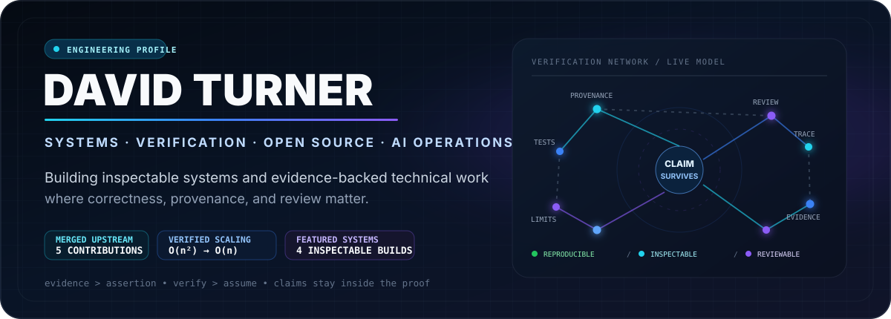
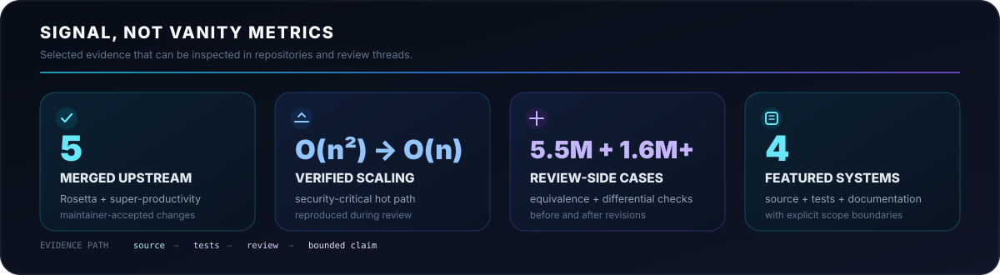
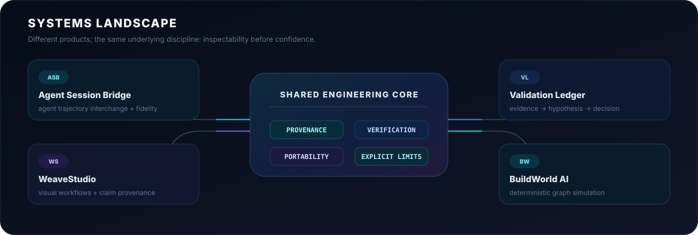
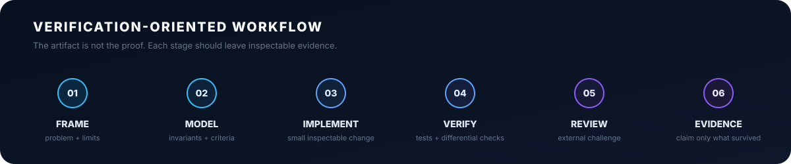
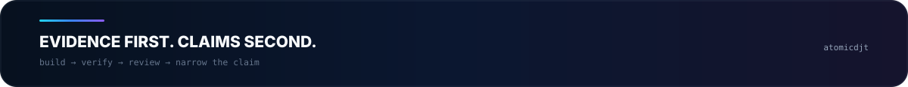

 

  

**I build systems whose claims can be inspected.**

Software, open-source contributions, and technical writing centered on verification, provenance, explicit limits, and reviewable evidence.

 

## Systems I build

<table>
<tr>
<td width="50%" valign="top">

<h3>↔️ Agent Session Bridge</h3>

**Portable coding-agent trajectories without pretending portability is native resumption.**

ATIF v1.7 reference implementation with namespaced fidelity/loss accounting, Claude Code normalization, OpenInference projection, and explicit boundaries around what cannot survive an agent handoff.

<b>Python 3.11+ · Pydantic · pytest · mypy · Ruff · OpenTelemetry</b>

  

<a href="https://github.com/atomicdjt/agent-session-bridge"><b>Source →</b></a> &nbsp;·&nbsp; <a href="https://github.com/atomicdjt/agent-session-bridge/issues">Issues</a>

</td>
<td width="50%" valign="top">

<h3>🧾 Validation Ledger</h3>

**A traceable decision system built around evidence, counterevidence, and inspectable scoring.**

Local-first evidence → hypothesis → decision workflows with an independent-oracle differential test suite designed to expose scoring divergence instead of hiding it.

<b>TypeScript · React · Dexie · Vitest · Playwright · axe-core</b>

  

<a href="https://github.com/atomicdjt/validation-ledger"><b>Source →</b></a> &nbsp;·&nbsp; <a href="https://validation-ledger.vercel.app/">Live demo</a>

</td>
</tr>
<tr>
<td width="50%" valign="top">

<h3>🕸️ WeaveStudio</h3>

**Visual workflows where claims retain a path back to their sources and human review gates.**

Local-first workflow composition with claim provenance, portable exports, browser verification, accessibility checks, and acquisition-package validation.

<b>TypeScript · React · XYFlow · Vitest · Playwright · jsPDF</b>

  

<a href="https://github.com/atomicdjt/weavestudio"><b>Source →</b></a> &nbsp;·&nbsp; <a href="https://weavestudio-nine.vercel.app/">Live demo</a>

</td>
<td width="50%" valign="top">

<h3>◉ BuildWorld AI</h3>

**Deterministic graph simulation for cascades, sensitivity, and reproducible scenario analysis.**

A visual simulation lab with graph-based propagation, stability heuristics, reproducibility metadata, and exportable scenario reports.

<b>TypeScript · React · Vitest · Playwright · Vite</b>

  

<a href="https://github.com/atomicdjt/buildworld-ai"><b>Source →</b></a> &nbsp;·&nbsp; <a href="https://buildworld-ai-v01-improvements.vercel.app/">Live demo</a>

</td>
</tr>
</table>

## External proof: upstream engineering

My strongest credibility signal is not repository count or self-reported expertise; it is work that survived outside review.

| PR | Project | What changed | Result |
| --- | --- | --- | --- |
| [#320](https://github.com/griddynamics/rosetta/pull/320) | Grid Dynamics Rosetta | Removed quadratic backtracking from a dangerous-command matcher | **Merged** after independent equivalence, scaling, and mutation checks |
| [#319](https://github.com/griddynamics/rosetta/pull/319) | Grid Dynamics Rosetta | Removed unreachable authorization behavior and hardened dataset lookup | **Merged** after substantive review and correction |
| [#322](https://github.com/griddynamics/rosetta/pull/322) | Grid Dynamics Rosetta | Added regression coverage for dataset-name resolution branches | **Merged** after fixture gaps were identified and corrected |
| [#299](https://github.com/griddynamics/rosetta/pull/299) | Grid Dynamics Rosetta | Extended a dangerous-action guard to equivalent force-delete forms | **Merged** |
| [#9619](https://github.com/johannesjo/super-productivity/pull/9619) | super-productivity | Kept visible task order synchronized with persistent movement actions | **Merged** |

> **Rosetta #320 is the clearest proof point.** A reviewer independently checked equivalence across roughly **5.5 million inputs**, then re-verified the corrected head across **1.6+ million differential cases** after review changes. The review also reproduced the **O(n²) → O(n)** scaling and mutation-checked the verification harness.

**[Read the external-validation case study →](writing/external-validation-upstream-review.md)**

Transparency: <a href="https://github.com/openclaw/openclaw/pull/125740">OpenClaw #125740</a> was closed without merge or recorded human approval. I do not present it as accepted upstream work.

> **Repository taxonomy:** the repositories presented as original systems use the shared portfolio identity. Public forks used for upstream contribution work intentionally retain their upstream branding and history rather than being styled as original projects.

## Engineering method

The recurring pattern is deliberate: **define what must remain true → make the smallest defensible change → build checks capable of falsifying the claim → invite review → narrow the final claim to what survives.**

## Tooling represented in the work

## Technical writing

<table>
<tr>
<td width="50%" valign="top">

### External validation
**[What upstream review actually established →](writing/external-validation-upstream-review.md)**

A compact evidence record for the merged Rosetta and super-productivity contributions.

</td>
<td width="50%" valign="top">

### Agent interoperability
**[From Claude Code JSONL to ATIF v1.7 →](writing/from-claude-code-jsonl-to-atif-v1-7.md)**

What survives an agent handoff, what is lost, and why interchange is not native session resumption.

</td>
</tr>
<tr>
<td width="50%" valign="top">

### Verification
**[Your AI agent finished the task. What did it actually prove? →](writing/your-ai-agent-finished-the-task.md)**

Separating artifact, behavioral, provenance, boundary, and independent evidence.

</td>
<td width="50%" valign="top">

### Technical communication
**[Pull request descriptions that survive review →](writing/pull-request-descriptions-that-survive-review.md)**

PR structure designed to expose assumptions, verification, and limitations to scrutiny.

</td>
</tr>
</table>

<b>AI-assisted authorship & claim boundaries</b>

 

This is an **AI-assisted portfolio**. I direct product strategy, requirements, scope boundaries, acceptance criteria, verification expectations, and public claims. AI systems assist with implementation, research, debugging, testing, and drafting; I review, revise, reject, validate, and take responsibility for what is published.

Commercial availability does not imply verified revenue, customers, active users, or completed acquisitions. Deterministic scores are heuristics, not certified predictions. Local-first storage is not automatically encrypted, durable, synchronized, or compliant.

 

### Useful criticism is specific

If you find a broken assumption, weak verification step, misleading claim, confusing interface, or a simpler design, **open an issue**.

[**Portfolio**](https://ai-project-portfolio-portfolio-hub.vercel.app/) · [**Repositories**](https://github.com/atomicdjt?tab=repositories) · [**Writing**](writing/) · [**LinkedIn**](https://www.linkedin.com/in/david-turner-6052491a2) · [**Email**](mailto:davidelsey9513@gmail.com)

 

